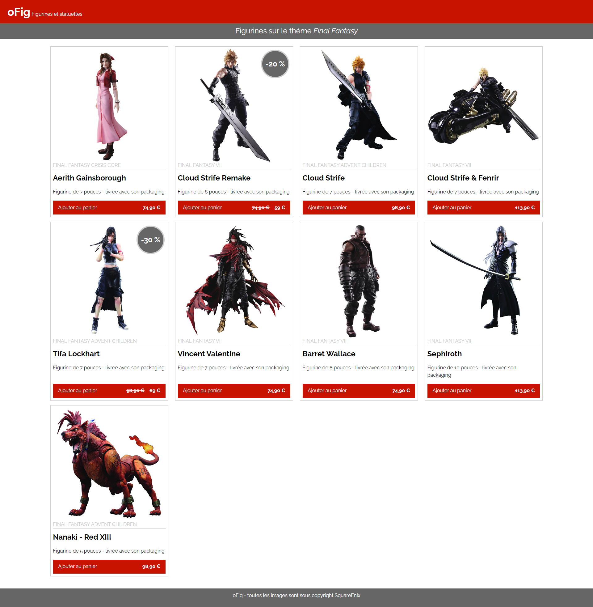

# Flo2ent-Oclock-Dev-Web-oFig-Challenge

## À propos

Ma réalisation du challenge « oFig » de la formation « Développeur Web Full stack JavaScript » de l'École O'clock

## Instructions

L’objectif était de réaliser l'intégration d'une boutique de figurines en utilisant des balises sémantiques HTML et CSS Flexbox.

## Capture d'écran de ma réalisation

